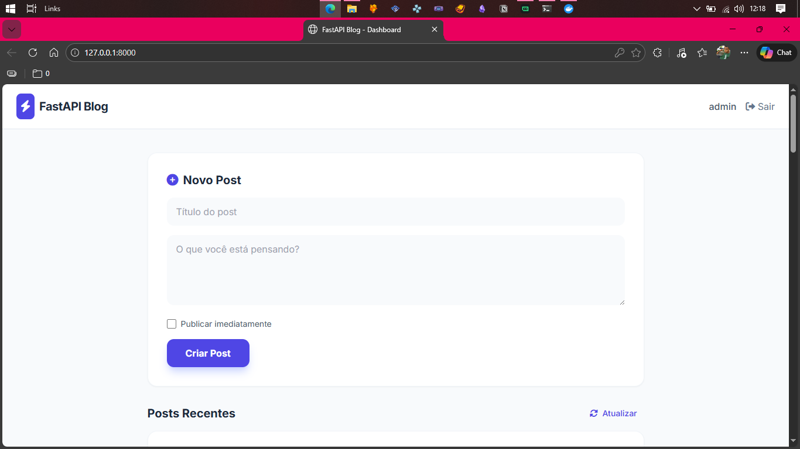
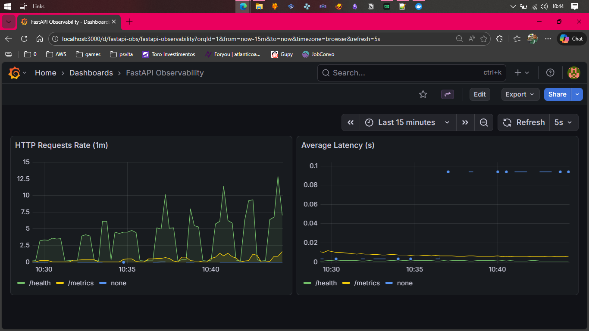
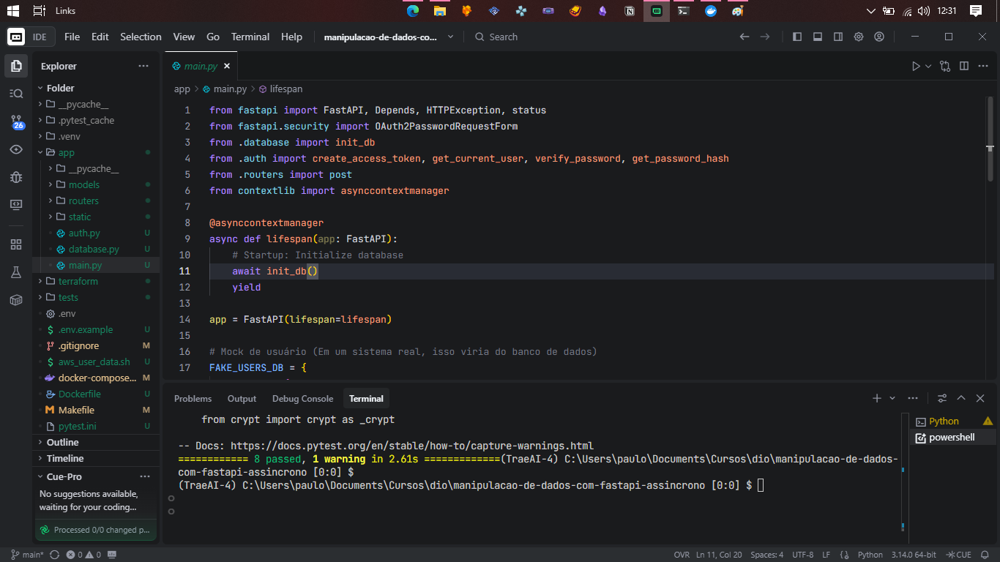

# Manipulação de Dados com FastAPI Assíncrono


*Interface moderna do projeto construída com Tailwind CSS*

---


*Painel de monitoramento (Grafana) exibindo métricas em tempo real da API*

---


*Estrutura de código assíncrono e execução de testes automatizados*

---

Este projeto demonstra como realizar a manipulação de dados de forma assíncrona utilizando FastAPI, SQLAlchemy e PostgreSQL via Docker, incluindo autenticação JWT e testes automatizados.

---

## 💼 Portfólio e Carreira
Para uma visão detalhada das competências técnicas aplicadas neste projeto, consulte o arquivo [PORTFOLIO.md](PORTFOLIO.md). Ele foi estruturado para auxiliar em processos seletivos e demonstrações técnicas.

---

## 🌍 Projeto em Produção (Live)
O projeto está hospedado e pode ser acessado publicamente:
- **Frontend & API**: [https://manipulacao-de-dados-com-fastapi.onrender.com](https://manipulacao-de-dados-com-fastapi.onrender.com)
- **Banco de Dados**: Gerenciado via [Neon.tech](https://neon.tech/) (PostgreSQL Serverless).

---

## ☸️ Orquestração Kubernetes (Local & Produção)
O projeto agora suporta orquestração via Kubernetes para alta disponibilidade:
- **Arquitetura:** 1 Control-Plane e 3 Worker Nodes (simulado via Kind).
- **Auto-Healing:** Configurado com 2 réplicas e Probes de Liveness/Readiness.
- **Gerenciamento:** Comandos simplificados via `Makefile`.

### **Comandos Kubernetes:**
- `wsl make k8s-cluster`: Cria o cluster multi-node (1 CP, 3 Workers).
- `wsl make k8s-deploy`: Faz o deploy da aplicação e configurações no cluster.
- `wsl make k8s-forward`: Abre o túnel para acessar a API em `http://localhost:8000`.
- `wsl make k8s-logs`: Monitora os logs dos pods em tempo real.
- `wsl make k8s-monitoring`: Instala a stack de monitoramento (Prometheus + Grafana).
- `wsl make k8s-grafana`: Abre o túnel para o Grafana em `http://localhost:3000`.
- `wsl make k8s-prometheus`: Abre o túnel para o Prometheus em `http://localhost:9090`.
- `wsl make k8s-grafana-url`: Mostra as credenciais de acesso ao Grafana.
- `wsl make k8s-status`: Verifica a saúde dos nós, pods e serviços.

---

## 📊 Observabilidade
O projeto conta com monitoramento profissional via **Prometheus** e **Grafana**, totalmente automatizado:
- **Prometheus**: Coleta métricas de performance da API (latência, requisições, erros).
- **Grafana**: Visualização em dashboards modernos.
- **Automação**: O Grafana já inicia com o **Datasource (Prometheus)** e o **Dashboard (FastAPI Metrics)** pré-configurados via Sidecar (ConfigMaps).
- **Acesso**: 
  - Usuário: `admin`
  - Senha: `admin`

---

## 🚀 Tecnologias
- **FastAPI**: Framework web moderno e rápido.
- **PostgreSQL**: Banco de dados relacional.
- **SQLAlchemy (Async)**: ORM para mapeamento objeto-relacional assíncrono.
- **Docker & Docker Compose**: Para orquestração do banco de dados.
- **JWT (JSON Web Tokens)**: Autenticação segura com Bearer tokens.
- **Pytest**: Suíte de testes automatizados assíncronos.
- **Makefile**: Para facilitar a execução de comandos comuns no ambiente WSL.

## 🛠️ Como rodar o projeto

### Pré-requisitos
- Docker e Docker Compose instalados.
- Python 3.10+ instalado.
- WSL 2 (obrigatório para uso do Makefile no Windows).

### Passo a Passo

1. **Subir o Banco de Dados (PostgreSQL)**
   ```bash
   wsl make up
   ```

2. **Instalar Dependências (Cria Ambiente Virtual)**
   ```bash
   wsl make install
   ```
   *Este comando cria automaticamente um ambiente virtual (`.venv`) e instala todas as dependências, incluindo correções de compatibilidade para `bcrypt`.*

3. **Executar a Aplicação**
   ```bash
   wsl make run-app
   ```
   A aplicação estará disponível em `http://localhost:8000`. 
   *O frontend será carregado automaticamente na raiz `/`.*

4. **Interface Gráfica (Frontend)**
   O projeto agora conta com uma interface moderna construída com **Tailwind CSS**. 
   - **Login**: Autenticação via JWT.
   - **Dashboard**: Visualização e criação de posts em tempo real.
   - **Exclusão**: Gerenciamento de posts diretamente pela interface.

5. **Executar os Testes**
   ```bash
   wsl make test
   ```
   Executa a suíte completa de testes de autenticação e CRUD de posts.

6. **Acessar Documentação (Swagger)**
   Acesse `http://localhost:8000/docs` para interagir com a API.

## 📁 Estrutura de Arquivos

- `app/`: Pasta principal da aplicação.
  - `main.py`: Ponto de entrada e configuração do FastAPI com `lifespan`.
  - `auth.py`: Lógica de autenticação JWT, hashing de senhas e segurança.
  - `database.py`: Configuração da conexão assíncrona com PostgreSQL.
  - `models/`: Definições de tabelas e esquemas Pydantic.
  - `routers/`: Rotas da API (Posts, etc).
- `tests/`: Suíte de testes automatizados.
- `docker-compose.yml`: Configuração do container PostgreSQL 15.
- `Makefile`: Atalhos para comandos frequentes no ambiente WSL.
- `pytest.ini`: Configurações do ambiente de testes assíncronos.

## 🔐 Autenticação
A API utiliza autenticação **Bearer Token (JWT)**.
- **Token Expiration**: 30 minutos.
- **Claims**: iss, aud, exp, iat, nbf, jti.
- **Credenciais de Teste**: 
  - Usuário: `admin`
  - Senha: `admin123`

## ⚙️ Configuração do Banco de Dados
O banco utiliza `SQLAlchemy` com `asyncpg`. A criação das tabelas ocorre automaticamente na inicialização da aplicação através do gerenciador de contexto `lifespan`.

---

## 🚀 Roadmap e Próximos Passos
- [x] **Dockerization**: `Dockerfile` pronto para produção.
- [x] **Orquestração**: Kubernetes com `kind` para alta disponibilidade local.
- [x] **CI/CD Pipeline**: GitHub Actions para testes automatizados.
- [x] **Monitoramento**: Prometheus e Grafana implementados no cluster Kubernetes.
- [x] **Dashboard Automatizado**: Dashboards do Grafana via ConfigMaps.
